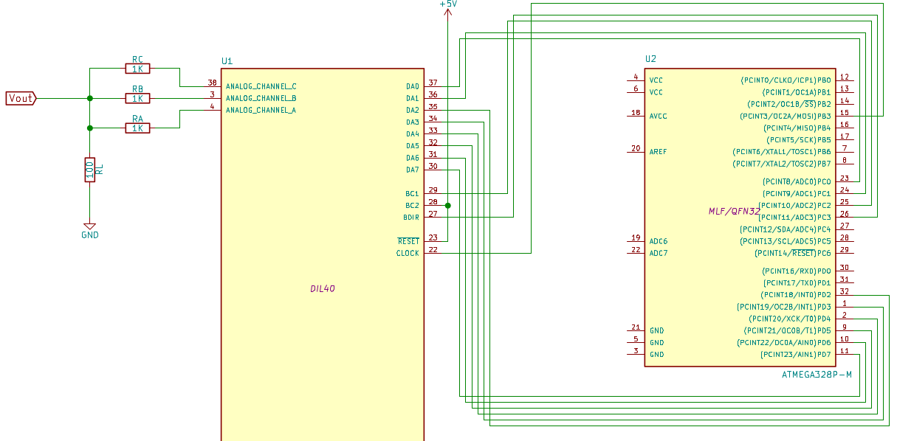

##ZX Spectrum AY ports

The AY-3-8912 sound chip is a widely used one, to be found in the MSX, Vectrex, Amstrad CPC range, etc. It is controlled by two I/O ports:\

OUT (0xfffd)   - Select a register 0-14\
IN  (0xfffd)   - Read the value of the selected register\
OUT (0xbffd)   - Write to the selected register\

## More information

More information can be found on the blog:

* [Driving YM2149F sound chip with an Arduino][2]
* [Arduino Hello World without IDE][3]

Besides, a video showing the [YM2149 & Arduino circuit playing a tune][1] is
available.

[1]: https://www.youtube.com/watch?v=MTRJdDbY048
[2]: http://www.florentflament.com/blog/driving-ym2149f-sound-chip-with-an-arduino.html
[3]: http://www.florentflament.com/blog/arduino-hello-world-without-ide.html

## schematic wiring helper

